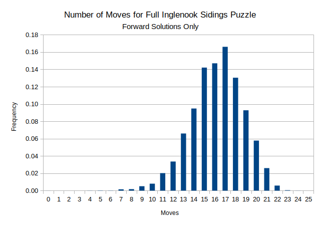

## Study of heuristic solutions to all standard problems of Inglenook Sidings Shunting Puzzle

### Results

- There are 8! = 40320 standard starting conditions for the full version of the puzzle. The solutions were calculated a few thousand at a time using the function read_permutations compiled into an executable using mlton.  The number of moves needed for each start are shown in the spreadsheet full-solutions.ods.  The individual solution steps were not kept.

### Solution Method

- The solution method first breaks the solution into two parts.  The first part uses an interative deepening depth-first search to find a solution from the starting condition to an intermediate condition where the last three positions (by the bumper) on Track 1 are the same as specified in the final condition (and all other track positions are arbitrary).  The second part then uses the same search method to find a solution from this intermediate condition to the end condition.  This gives a "forward" solution.  This "heuristic" method was chosen as it seems to be a natural strategy for this puzzle (see Blackburn's paper, mentioned below).

### Comments on Results

- In his excellent paper "Inglenook Shunting Puzzles," Simon Blackburn states that for all starting conditions only 20 moves or less are needed for optimal solutions (minimum possible number of moves and no intermediate node is used) of the full-sized puzzle.  A histogram of the results found in this study is here:

  

- As expected, using an intermediate node results in solutions generally  longer than an optimal solution would be.  However, only a small fraction of these solutions have more than 20 moves.

- Of the 40320 starting conditions, only 1307 (about 3.25%) required 21 or more moves for a solution.  Only 24 required more than 22 moves.  None of these solutions required more than 24 moves.

- I believe these results support Simon's comment that the heuristic of "working from the back wagons forward [from the bumper end of the siding]" is reasonably efficient.  Also, the longer optimal solutions might require very deep "look ahead" thinking for a human to develop.  The heuristic solutions found here seem to be similar to what a good human puzzle solver would do.

 *** Table of the full results *** 

| Move | Cum Count  | Count  | Freq   | Cum Freq |
| :--: | :-------:  | :----: | :----: | :------: |
|  0	 | 1	        | 1	     |0.0000  |0.0000
|  1	 | 1	        | 0	     |0.0000  |0.0000
|  2	 | 1	        | 0	     |0.0000	|0.0000
|  3	 | 1	        | 0	     |0.0000	|0.0000
|  4	 | 6	        | 5	     |0.0001	|0.0001
|  5	 | 15	        | 9	     |0.0002  |0.0004
|  6	 | 22	        | 7	     |0.0002	|0.0005
|  7	 | 82	        | 60	   |0.0015	|0.0020
|  8	 | 150	      | 68	   |0.0017	|0.0037
|  9	 | 356	      | 206	   |0.0051	|0.0088
|  10  | 679       	| 323	   |0.0080	|0.0168
|  11  | 1494       |	815	   |0.0202	|0.0371
|  12  | 2849       |	1355	 |0.0336	|0.0707
|  13  | 5508       |	2659	 |0.0659	|0.1366
|  14  | 9332	      | 3824	 |0.0948	|0.2314
|  15  | 15060	    | 5728	 |0.1421	|0.3735
|  16  | 20988	    | 5928	 |0.1470	|0.5205
|  17  | 27684	    | 6696	 |0.1661	|0.6866
|  18  | 32941	    | 5257	 |0.1304	|0.8170
|  19  | 36683	    | 3742	 |0.0928	|0.9098
|  20  | 39013	    | 2330	 |0.0578	|0.9676
|  21  | 40061	    | 1048	 |0.0260	|0.9936
|  22  | 40296	    | 235	   |0.0058	|0.9994
|  23  | 40317	    | 21	   |0.0005	|0.9999
|  24  | 40320	    | 3	     |0.0001	|1.0000
|  25  | 40320	    | 0	     |0.0000	|1.0000

