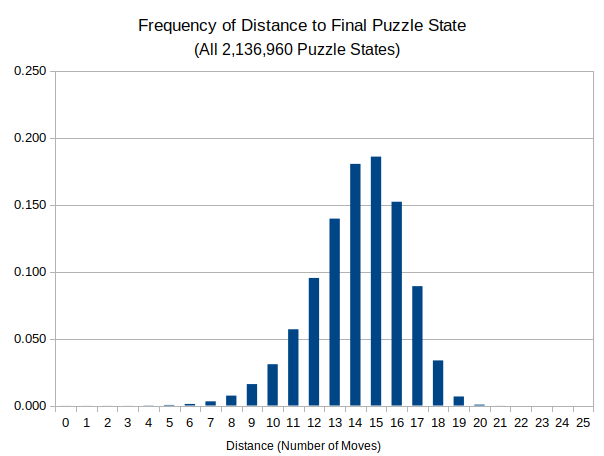

## Programs to find optimal solutions for the Inglenook Sidings puzzle
---
### inglenook-sidings-dijkstra.sml

Find optimal solutions to a classic shunting (switching) puzzle using
Dijkstra's algorithm.

This program is intended to be run after compilation with mlton.  To do
so, uncomment the statement "main();" at the end of the file and run

  `mlton -output <executable name> inglenook-sidings-dijkstra.sml`

in a terminal.  On a 3 GHz laptop the program run time was about 9 hours.

The program will write two files, one with all 40320 standard starting
conditions together with the number of moves in a minimal solution.  The
other file contains the data from the table used with Dijkstra's
algorithm (except for the "visited" column).  That file can be read by
the program in inglenook-sidings-full-opt.sml which is used to print
solution paths from any puzzle state to the standard finish state and to
generate random standard puzzle problems and optimal solutions for them.
The two files are:

- **num-moves.txt.**  Contains one line for each standard puzzle starting state
  showing the starting track occupancies and the number of solution moves.

- **dijkstra-table.txt.**  Contains columns from the table used in Dijkstra's
  algorithm.

---
### inglenook-sidings-full-opt.sml

Print optimal solution paths.  Uses table produced by Dijkstra's algorithm.

#### Directions for use:

  - Run the program in inglenook-sidings-dijkstra.sml to produce the file
    dijkstra-table.txt.  This will take 9 or more hours.  See that program's
    comments for further information.

  - Start Poly/ML in a terminal to get an interactive Standard ML session
    and enter at the prompt

      `use("inglenook-sidings-full-opt.sml");`

    to load this program.  (You may need to include the director path to
    the file.)  The semicolon is necessary.

  - After the file is loaded, at the prompt enter

      `read_table_file("dijkstra-table.txt");`

    to load the data from Dijkstra's algorithm.  (Again, you may need to
    pre-pend a path name.)  Loading will take a minute or two.

  - To generate a random puzzle problem, enter

      `generate_problem(1);`

    An example of the output from this is:
```
        Start state: ([0],[5,7,2,1,8],[3,4,6],[])
        Moves: 15
        Solution:
        ([0],[5,7,2,1,8],[3,4,6],[])
        ([0,5,7,2],[1,8],[3,4,6],[])
        ([0],[1,8],[3,4,6],[5,7,2])
        ([0,1,8],[],[3,4,6],[5,7,2])
        ([0,1,8,5],[],[3,4,6],[7,2])
        ([0,1,8],[5],[3,4,6],[7,2])
        ([0,1],[5],[3,4,6],[8,7,2])
        ([0,1,3,4],[5],[6],[8,7,2])
        ([0,1],[3,4,5],[6],[8,7,2])
        ([0,1,6],[3,4,5],[],[8,7,2])
        ([0,1,6,8],[3,4,5],[],[7,2])
        ([0,1,6],[3,4,5],[8],[7,2])
        ([0,1,6,7],[3,4,5],[8],[2])
        ([0,1],[3,4,5],[6,7,8],[2])
        ([0,1,2],[3,4,5],[6,7,8],[])
        ([0],[1,2,3,4,5],[6,7,8],[])
```
  - The solution is a series of puzzle states from the start to the finish.
    Each state is a 4-tuple (t0, t1, t2, t3) where the entries tn are a
    list of integers representing cars on a siding.  The cars are numbered
    1 through 8.  The zero is the shunting engine and the first track is the
    shunting lead.

    Change the 1 to a larger value if you want to generate more problems
    in this step.  To do the same thing, but write the results to a file,
    enter:

    `generate_problem_file(1, "name of output file in quotes");`

  - To get an optimal solution to a particular starting condition (standard
    or not) you can use the function solve_opt.  An example is:
```
      solve_opt(([0], [7,3,1,2,6], [5,4,8], []));

      Moves: 13
      Solution:
      ([0],[7,3,1,2,6],[5,4,8],[])
      ([0,5,4],[7,3,1,2,6],[8],[])
      ([0,5,4,7],[3,1,2,6],[8],[])
      ([0,5,4],[3,1,2,6],[7,8],[])
      ([0,5,4,3],[1,2,6],[7,8],[])
      ([0],[1,2,6],[7,8],[5,4,3])
      ([0,1,2,6],[],[7,8],[5,4,3])
      ([0,1,2],[],[6,7,8],[5,4,3])
      ([0,1,2,5],[],[6,7,8],[4,3])
      ([0,1,2],[5],[6,7,8],[4,3])
      ([0,1,2,4],[5],[6,7,8],[3])
      ([0,1,2],[4,5],[6,7,8],[3])
      ([0,1,2,3],[4,5],[6,7,8],[])
      ([0],[1,2,3,4,5],[6,7,8],[])
```
    Note that the engine "0" must always be the first entry on the lead
    track.

  - To exit the Poly/ML session, hit Cntl-d.

#### Additional output

The total number of puzzle states is 2,136,960 of which 40320 are "standard"
starting conditions.  To get a breakdown of this total number by the number
of moves to the finish state (distance from the root node) enter:

`find_count_dist("count-dist.txt", dist_to_root);`

before exiting the program.  This produces a file "count-dist.txt" which
contains this table:

```
Moves: 0	Count: 1
Moves: 1	Count: 6
Moves: 2	Count: 18
Moves: 3	Count: 73
Moves: 4	Count: 267
Moves: 5	Count: 851
Moves: 6	Count: 2517
Moves: 7	Count: 6641
Moves: 8	Count: 15806
Moves: 9	Count: 34183
Moves: 10	Count: 65936
Moves: 11	Count: 121738
Moves: 12	Count: 203709
Moves: 13	Count: 298383
Moves: 14	Count: 385716
Moves: 15	Count: 397284
Moves: 16	Count: 325290
Moves: 17	Count: 190582
Moves: 18	Count: 71974
Moves: 19	Count: 14475
Moves: 20	Count: 1499
Moves: 21	Count: 11
Moves: 22	Count: 0
Moves: 23	Count: 0
Moves: 24	Count: 0
Moves: 25	Count: 0
```

This is a histogram of these values:

  

This plot and others comparing this to just the standard starting states
are in the spreadsheet file "count-dist.ods".
